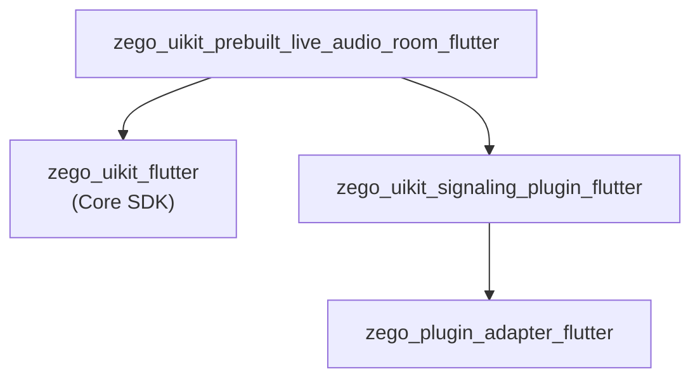

# ZegoUIKitPrebuiltLiveAudioRoom Architecture

> Audio room SDK with seat-based microphone system

## Overview

`zego_uikit_prebuilt_live_audio_room_flutter` is a **prebuilt UI SDK for live audio chat rooms**:

- **Audio only**: No video, voice only
- **Seat mode**: Microphone seat system like a stage
- **Role separation**: Host vs Speaker vs Listener
- **Real-time text chat**

**Depends on**: `zego_uikit_flutter` (core SDK)

## Package Relationship



## Core Pattern: Seat-Based Architecture

The audio room uses a **seat-based (Seat) mode** to manage users going on/off the stage:

```
ZegoLiveAudioRoomRole
├── host      # Host: creates room, manages seats
├── speaker   # Speaker: on stage, can speak
└── listener  # Listener: listening only, cannot speak
```

## Quick Start

### Host (Create Audio Room)

```dart
import 'package:zego_uikit_prebuilt_live_audio_room/zego_uikit_prebuilt_live_audio_room.dart';

class AudioRoomPage extends StatelessWidget {
  @override
  Widget build(BuildContext context) {
    return ZegoUIKitPrebuiltLiveAudioRoom(
      appID: yourAppID,
      appSign: yourAppSign,
      userID: currentUserID,
      userName: currentUserName,
      roomID: 'audio_room_001',
      config: ZegoUIKitPrebuiltLiveAudioRoomConfig(
        role: ZegoLiveAudioRoomRole.host,
      )..hostConfig(
        bottomMenuBar: ZegoLiveAudioRoomBottomMenuBarConfig(
          buttons: [
            ZegoLiveAudioRoomMenuBarButtonName.toggleMicrophone,
            ZegoLiveAudioRoomMenuBarButtonName.inviteToConnect,
            ZegoLiveAudioRoomMenuBarButtonName.removeFromRoom,
          ],
        ),
      ),
    );
  }
}
```

### Listener (Join Audio Room)

```dart
ZegoUIKitPrebuiltLiveAudioRoom(
  appID: yourAppID,
  appSign: yourAppSign,
  userID: currentUserID,
  userName: currentUserName,
  roomID: 'audio_room_001',
  config: ZegoUIKitPrebuiltLiveAudioRoomConfig(
    role: ZegoLiveAudioRoomRole.listener,
  )..listenerConfig(
    bottomMenuBar: ZegoLiveAudioRoomBottomMenuBarConfig(
      buttons: [
        ZegoLiveAudioRoomMenuBarButtonName.requestConnect,
      ],
    ),
  ),
)
```

## Seat Management

Seats are the core concept of audio rooms, similar to microphone positions on a stage.

### Get Seat Info

```dart
final controller = ZegoUIKitPrebuiltLiveAudioRoomController();

// Get all seats
final seats = controller.seat.getSeats();

// Get user's seat
int? seatIndex = controller.seat.getUserSeatIndex('userID');

// Get user on seat
final userOnSeat = controller.seat.getUserOnSeat(0);
```

### Host: Manage Seats

```dart
// Lock seat (prevent users from taking)
await controller.seat.lockSeat(seatIndex: 0, lockUser: true);

// Unlock seat
await controller.seat.lockSeat(seatIndex: 0, lockUser: false);

// Assign user to seat
await controller.seat.assignSeat(userID: 'userID', seatIndex: 1);

// Remove user from seat
await controller.seat.removeSpeaker(userID: 'userID');

// Set seat count
await controller.seat.setSeatCount(6);  // 6 seats
```

### User: Request/Leave Seat

```dart
// Request to speak
await controller.seat.requestSeat();

// Cancel request
await controller.seat.cancelSeatRequest();

// Leave seat voluntarily
await controller.seat.leaveSeat();
```

## Configuration Pattern

```dart
ZegoUIKitPrebuiltLiveAudioRoomConfig config = ZegoUIKitPrebuiltLiveAudioRoomConfig(
  role: ZegoLiveAudioRoomRole.host,
)
  // Seat config
  ..seatConfig(
    ZegoLiveAudioRoomSeatConfig(
      rowCount: 2,     // Number of rows
      colCount: 3,     // Seats per row
    ),
  )

  // Host config
  ..hostConfig(
    topMenuBar: ZegoLiveAudioRoomTopMenuBarConfig(
      title: 'Audio Room',
      showRoomCloseButton: true,
    ),
    bottomMenuBar: ZegoLiveAudioRoomBottomMenuBarConfig(
      buttons: [...],
    ),
  )

  // Listener config
  ..listenerConfig(
    bottomMenuBar: ZegoLiveAudioRoomBottomMenuBarConfig(
      buttons: [ZegoLiveAudioRoomMenuBarButtonName.requestConnect],
    ),
  );
```

### Seat Config

```dart
ZegoLiveAudioRoomSeatConfig(
  rowCount: 2,           // Number of rows
  colCount: 3,           // Seats per row
  seatCount: 6,          // Total seats (rowCount * colCount)
  showSeatOnMap: true,    // Show seat map
  enableTakeOnSeat: true, // Allow users to take seat voluntarily
  enableLockSeat: true,   // Allow locking seats
)
```

## Style Customization

```dart
ZegoUIKitPrebuiltLiveAudioRoomStyle style = ZegoUIKitPrebuiltLiveAudioRoomStyle(
  // Background
  backgroundColor: Colors.black,
  backgroundImage: 'assets/bg.png',

  // Seat style
  seatBackgroundColor: Colors.grey[800],
  seatBorderColor: Colors.transparent,
  seatActiveBorderColor: Colors.amber,

  // Avatar style
  avatarSize: Size(60, 60),
  avatarBorderColor: Colors.grey,

  // Audio icon
  audioIndicatorColor: Colors.green,
  audioOffIndicatorColor: Colors.red,

  // Text style
  userNameTextStyle: TextStyle(color: Colors.white, fontSize: 14),
  roomTitleTextStyle: TextStyle(color: Colors.white, fontSize: 18),
);
```

## Events

```dart
ZegoUIKitPrebuiltLiveAudioRoomEvents(
  // User events
  onUserJoin: (user) {
    print('${user.name} joined the room');
  },
  onUserLeave: (user) {
    print('${user.name} left the room');
  },

  // Seat events
  onSeatChanged: (seatIndex, user) {
    print('Seat $seatIndex changed: ${user?.name ?? 'empty'}');
  },
  onSeatLocked: (seatIndex, isLocked) {
    print('Seat $seatIndex is ${isLocked ? 'locked' : 'unlocked'}');
  },

  // Speaking events
  onSpeakerJoined: (user, seatIndex) {
    print('${user.name} joined as speaker at seat $seatIndex');
  },
  onSpeakerLeft: (user) {
    print('${user.name} stopped speaking');
  },

  // Request events (host)
  onSeatRequestReceived: (user) {
    print('${user.name} wants to speak');
  },
  onSeatRequestAccepted: () {
    print('Your request to speak was accepted');
  },
  onSeatRequestRejected: () {
    print('Your request to speak was rejected');
  },

  // Message
  onReceiveCustomCommand: (fromUser, command) {},

  // Error
  onError: (errorCode, errorMessage) {},
)
```

## Controller API

```dart
final controller = ZegoUIKitPrebuiltLiveAudioRoomController();

// Leave room
await controller.leave();

// Minimize
controller.minimize.minimize(context);
controller.minimize.restore(context);

// Audio/video control (for self)
controller.audioVideo.muteMicrophone(true);
controller.audioVideo.muteCamera(true);  // No camera in audio room, but API exists

// User management
final users = controller.user.getAllUsers();
final speakers = controller.user.getSpeakers();
final listeners = controller.user.getListeners();

// Message
controller.message.send('Hello everyone!');
```

### Controller Mixins

| Mixin | Description |
|-------|-------------|
| `ZegoLiveAudioRoomControllerAudioVideo` | Audio/video control |
| `ZegoLiveAudioRoomControllerSeat` | Seat management |
| `ZegoLiveAudioRoomControllerRoom` | Room operations |
| `ZegoLiveAudioRoomControllerUser` | User management |
| `ZegoLiveAudioRoomControllerMedia` | Media control |
| `ZegoLiveAudioRoomControllerMessage` | Message |
| `ZegoLiveAudioRoomControllerMinimize` | Minimize |
| `ZegoLiveAudioRoomControllerPIP` | PiP |

## Directory Structure

```
lib/src/
├── live_audio_room.dart        # Main entry Widget
├── controller.dart             # Controller singleton
├── config.dart                 # ZegoUIKitPrebuiltLiveAudioRoomConfig
├── events.dart                 # Events
├── defines.dart               # Public defines
├── config.defines.dart        # Config-related defines
├── events.defines.dart
├── inner_text.dart
├── style.dart                  # Style definitions
├── components/                # UI components
│   ├── live_page.dart         # Main page
│   ├── mini_audio.dart        # Minimized view
│   ├── dialogs.dart           # Dialogs
│   ├── permissions.dart
│   ├── toast.dart
│   ├── audio_video/           # Seat layout
│   │   ├── seat_item.dart
│   │   └── seat_map.dart
│   ├── member/
│   ├── message/
│   ├── effects/
│   └── ...
├── controller/                # Controller mixins
│   ├── audio_video.dart
│   ├── seat.dart             # Seat control
│   ├── room.dart
│   ├── user.dart
│   ├── media.dart
│   ├── message.dart
│   ├── minimize.dart
│   ├── pip.dart
│   ├── log.dart
│   └── private/
├── core/                     # Core managers
│   └── core_managers.dart    # Contains HostManager, ConnectManager
├── minimizing/
├── internal/
└── deprecated/
```

## Seat Layout Visualization

```
┌─────────────────────────────────────┐
│           Audio Room                │
│         Host: @admin                │
├─────────────────────────────────────┤
│                                     │
│    [Seat 0]    [Seat 1]    [Seat 2] │
│     @user1      @user2      🔒       │
│    🔊🎤        🔊🎤        (locked)  │
│                                     │
│    [Seat 3]    [Seat 4]    [Seat 5] │
│     🔇🎤        empty        🔇🎤    │
│                 @user3               │
│                                     │
└─────────────────────────────────────┘
```

## Key Differences from Video Conference

| Aspect | Audio Room | Video Conference |
|--------|-----------|-------------------|
| Media | Audio only | Audio + Video |
| Seat Model | Formal seat system | Grid layout |
| Visual | Avatar + audio indicator | Video tiles |
| Role | host/speaker/listener | All equal participants |
| Controls | Seat-based management | Individual control |

## Common Issues & Solutions

### 1. Seats Full

When a user requests to speak but seats are full, they receive a rejection event:

```dart
onSeatRequestRejected: () {
  showToast('Seats are full, please try later');
}
```

### 2. Host Cannot Leave Stage

The host role cannot voluntarily leave the stage. They can only close the room or transfer host.

### 3. Listener Cannot Unmute

Listeners can only request to speak, cannot directly unmute. Must use `requestConnect` to apply.

## Dependency Packages

Core dependencies:
- `zego_uikit` - Core SDK
- `zego_plugin_adapter` - Plugin adapter
- `zego_uikit_signaling_plugin` - Signaling plugin
- `floating` - Android floating
- `permission_handler` - Permission management

## Related Documentation

- [ZegoUIKit Architecture](../zego_uikit_flutter/ARCHITECTURE.md)
- [ZegoUIKitPrebuiltVideoConference Architecture](../zego_uikit_prebuilt_video_conference_flutter/ARCHITECTURE.md)
