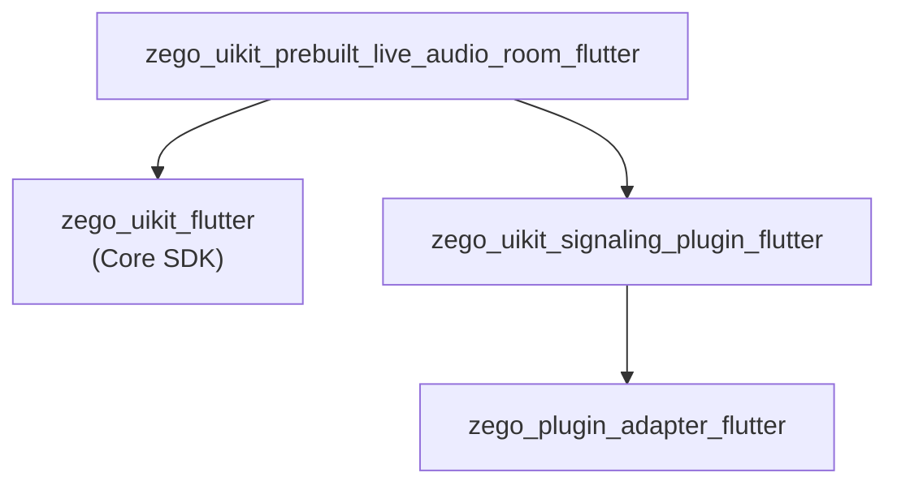

# ZegoUIKitPrebuiltLiveAudioRoom Architecture

> 语音房 SDK，纯音频、座位麦位模式

## Overview

`zego_uikit_prebuilt_live_audio_room_flutter` 是**语音聊天室预构建 UI SDK**：

- **纯音频**: 无视频，仅语音
- **座位模式**: 类似舞台的麦位系统
- **角色分离**: 房主 vs 主播 vs 听众
- **实时文字聊天**

**依赖**: `zego_uikit_flutter` (核心SDK)

## Package Relationship



## Core Pattern: Seat-Based Architecture

语音房使用**座位(Seat)模式**管理用户上麦：

```
ZegoLiveAudioRoomRole
├── host      # 房主：创建房间，管理麦位
├── speaker   # 主播：已上麦，可发言
└── listener  # 听众：仅收听，不能发言
```

## Quick Start

### 房主（创建语音房）

```dart
import 'package:zego_uikit_prebuilt_live_audio_room/zego_uikit_prebuilt_live_audio_room.dart';

class AudioRoomPage extends StatelessWidget {
  @override
  Widget build(BuildContext context) {
    return ZegoUIKitPrebuiltLiveAudioRoom(
      appID: yourAppID,
      appSign: yourAppSign,
      userID: currentUserID,
      userName: currentUserName,
      roomID: 'audio_room_001',
      config: ZegoUIKitPrebuiltLiveAudioRoomConfig(
        role: ZegoLiveAudioRoomRole.host,
      )..hostConfig(
        bottomMenuBar: ZegoLiveAudioRoomBottomMenuBarConfig(
          buttons: [
            ZegoLiveAudioRoomMenuBarButtonName.toggleMicrophone,
            ZegoLiveAudioRoomMenuBarButtonName.inviteToConnect,
            ZegoLiveAudioRoomMenuBarButtonName.removeFromRoom,
          ],
        ),
      ),
    );
  }
}
```

### 听众（进入语音房）

```dart
ZegoUIKitPrebuiltLiveAudioRoom(
  appID: yourAppID,
  appSign: yourAppSign,
  userID: currentUserID,
  userName: currentUserName,
  roomID: 'audio_room_001',
  config: ZegoUIKitPrebuiltLiveAudioRoomConfig(
    role: ZegoLiveAudioRoomRole.listener,
  )..listenerConfig(
    bottomMenuBar: ZegoLiveAudioRoomBottomMenuBarConfig(
      buttons: [
        ZegoLiveAudioRoomMenuBarButtonName.requestConnect,
      ],
    ),
  ),
)
```

## Seat Management (麦位管理)

座位是语音房的核心概念，类似舞台上的麦克风位置。

### 获取座位信息

```dart
final controller = ZegoUIKitPrebuiltLiveAudioRoomController();

// 获取所有座位
final seats = controller.seat.getSeats();

// 获取用户所在座位
int? seatIndex = controller.seat.getUserSeatIndex('userID');

// 获取座位上的用户
final userOnSeat = controller.seat.getUserOnSeat(0);
```

### 房主：管理麦位

```dart
// 锁定座位（禁止用户上麦）
await controller.seat.lockSeat(seatIndex: 0, lockUser: true);

// 解锁座位
await controller.seat.lockSeat(seatIndex: 0, lockUser: false);

// 让用户上麦到指定座位
await controller.seat.assignSeat(userID: 'userID', seatIndex: 1);

// 把用户从座位上移下
await controller.seat.removeSpeaker(userID: 'userID');

// 设置座位数量
await controller.seat.setSeatCount(6);  // 6个座位
```

### 用户：申请/离开座位

```dart
// 申请上麦
await controller.seat.requestSeat();

// 取消申请
await controller.seat.cancelSeatRequest();

// 主动下麦
await controller.seat.leaveSeat();
```

## Configuration Pattern

```dart
ZegoUIKitPrebuiltLiveAudioRoomConfig config = ZegoUIKitPrebuiltLiveAudioRoomConfig(
  role: ZegoLiveAudioRoomRole.host,
)
  // 座位配置
  ..seatConfig(
    ZegoLiveAudioRoomSeatConfig(
      rowCount: 2,     // 行数
      colCount: 3,     // 每行座位数
    ),
  )

  // 房主配置
  ..hostConfig(
    topMenuBar: ZegoLiveAudioRoomTopMenuBarConfig(
      title: 'Audio Room',
      showRoomCloseButton: true,
    ),
    bottomMenuBar: ZegoLiveAudioRoomBottomMenuBarConfig(
      buttons: [...],
    ),
  )

  // 听众配置
  ..listenerConfig(
    bottomMenuBar: ZegoLiveAudioRoomBottomMenuBarConfig(
      buttons: [ZegoLiveAudioRoomMenuBarButtonName.requestConnect],
    ),
  );
```

### Seat Config

```dart
ZegoLiveAudioRoomSeatConfig(
  rowCount: 2,           // 座位行数
  colCount: 3,           // 每行座位数
  seatCount: 6,          // 总座位数 (rowCount * colCount)
  showSeatOnMap: true,    // 显示座位图
  enableTakeOnSeat: true, // 允许用户自行上麦
  enableLockSeat: true,   // 允许锁定座位
)
```

## Style Customization

```dart
ZegoUIKitPrebuiltLiveAudioRoomStyle style = ZegoUIKitPrebuiltLiveAudioRoomStyle(
  // 背景
  backgroundColor: Colors.black,
  backgroundImage: 'assets/bg.png',

  // 座位样式
  seatBackgroundColor: Colors.grey[800],
  seatBorderColor: Colors.transparent,
  seatActiveBorderColor: Colors.amber,

  // 头像样式
  avatarSize: Size(60, 60),
  avatarBorderColor: Colors.grey,

  // 音频图标
  audioIndicatorColor: Colors.green,
  audioOffIndicatorColor: Colors.red,

  // 文字样式
  userNameTextStyle: TextStyle(color: Colors.white, fontSize: 14),
  roomTitleTextStyle: TextStyle(color: Colors.white, fontSize: 18),
);
```

## Events

```dart
ZegoUIKitPrebuiltLiveAudioRoomEvents(
  // 用户事件
  onUserJoin: (user) {
    print('${user.name} joined the room');
  },
  onUserLeave: (user) {
    print('${user.name} left the room');
  },

  // 麦位事件
  onSeatChanged: (seatIndex, user) {
    print('Seat $seatIndex changed: ${user?.name ?? 'empty'}');
  },
  onSeatLocked: (seatIndex, isLocked) {
    print('Seat $seatIndex is ${isLocked ? 'locked' : 'unlocked'}');
  },

  // 上麦事件
  onSpeakerJoined: (user, seatIndex) {
    print('${user.name} joined as speaker at seat $seatIndex');
  },
  onSpeakerLeft: (user) {
    print('${user.name} stopped speaking');
  },

  // 申请事件（房主）
  onSeatRequestReceived: (user) {
    print('${user.name} wants to speak');
  },
  onSeatRequestAccepted: () {
    print('Your request to speak was accepted');
  },
  onSeatRequestRejected: () {
    print('Your request to speak was rejected');
  },

  // 消息
  onReceiveCustomCommand: (fromUser, command) {},

  // 错误
  onError: (errorCode, errorMessage) {},
)
```

## Controller API

```dart
final controller = ZegoUIKitPrebuiltLiveAudioRoomController();

// 离开房间
await controller.leave();

// 最小化
controller.minimize.minimize(context);
controller.minimize.restore(context);

// 音视频控制（针对自己）
controller.audioVideo.muteMicrophone(true);
controller.audioVideo.muteCamera(true);  // 语音房无摄像头，但API存在

// 用户管理
final users = controller.user.getAllUsers();
final speakers = controller.user.getSpeakers();
final listeners = controller.user.getListeners();

// 消息
controller.message.send('Hello everyone!');
```

### Controller Mixins

| Mixin | 说明 |
|-------|------|
| `ZegoLiveAudioRoomControllerAudioVideo` | 音视频控制 |
| `ZegoLiveAudioRoomControllerSeat` | 麦位管理 |
| `ZegoLiveAudioRoomControllerRoom` | 房间操作 |
| `ZegoLiveAudioRoomControllerUser` | 用户管理 |
| `ZegoLiveAudioRoomControllerMedia` | 媒体控制 |
| `ZegoLiveAudioRoomControllerMessage` | 消息 |
| `ZegoLiveAudioRoomControllerMinimize` | 最小化 |
| `ZegoLiveAudioRoomControllerPIP` | PiP |

## Directory Structure

```
lib/src/
├── live_audio_room.dart        # 主入口 Widget
├── controller.dart             # Controller 单例
├── config.dart                 # ZegoUIKitPrebuiltLiveAudioRoomConfig
├── events.dart                 # Events
├── defines.dart               # 公共定义
├── config.defines.dart        # 配置相关定义
├── events.defines.dart
├── inner_text.dart
├── style.dart                  # 样式定义
├── components/                # UI 组件
│   ├── live_page.dart         # 主页面
│   ├── mini_audio.dart        # 最小化视图
│   ├── dialogs.dart           # 对话框
│   ├── permissions.dart
│   ├── toast.dart
│   ├── audio_video/           # 座位布局
│   │   ├── seat_item.dart
│   │   └── seat_map.dart
│   ├── member/
│   ├── message/
│   ├── effects/
│   └── ...
├── controller/                # Controller mixins
│   ├── audio_video.dart
│   ├── seat.dart             # 麦位控制
│   ├── room.dart
│   ├── user.dart
│   ├── media.dart
│   ├── message.dart
│   ├── minimize.dart
│   ├── pip.dart
│   ├── log.dart
│   └── private/
├── core/                     # 核心管理器
│   └── core_managers.dart    # 含 HostManager, ConnectManager
├── minimizing/
├── internal/
└── deprecated/
```

## Seat Layout Visualization

```
┌─────────────────────────────────────┐
│           Audio Room                │
│         Host: @admin                │
├─────────────────────────────────────┤
│                                     │
│    [Seat 0]    [Seat 1]    [Seat 2] │
│     @user1      @user2      🔒       │
│    🔊🎤        🔊🎤        (locked)  │
│                                     │
│    [Seat 3]    [Seat 4]    [Seat 5] │
│     🔇🎤        empty        🔇🎤    │
│                 @user3               │
│                                     │
└─────────────────────────────────────┘
```

## Key Differences from Video Conference

| Aspect | Audio Room | Video Conference |
|--------|-----------|-----------------|
| Media | Audio only | Audio + Video |
| Seat Model | Formal seat system | Grid layout |
| Visual | Avatar + audio indicator | Video tiles |
| Role | host/speaker/listener | All equal participants |
| Controls | Seat-based management | Individual control |

## Common Issues & Solutions

### 1. 座位已满

用户申请上麦时如果座位已满，会收到拒绝事件：

```dart
onSeatRequestRejected: () {
  showToast('Seats are full, please try later');
}
```

### 2. 房主无法主动下麦

房主角色无法主动离开座位，只能关闭房间或转让房主。

### 3. 听众无法开麦

听众只能请求上麦，不能直接开启麦克风。必须通过 `requestConnect` 申请。

## Dependency Packages

核心依赖：
- `zego_uikit` - 核心 SDK
- `zego_plugin_adapter` - 插件适配
- `zego_uikit_signaling_plugin` - 信令插件
- `floating` - Android 悬浮窗
- `permission_handler` - 权限管理

## Related Documentation

- [ZegoUIKit Architecture](../zego_uikit_flutter/ARCHITECTURE.md)
- [ZegoUIKitPrebuiltVideoConference Architecture](../zego_uikit_prebuilt_video_conference_flutter/ARCHITECTURE.md)