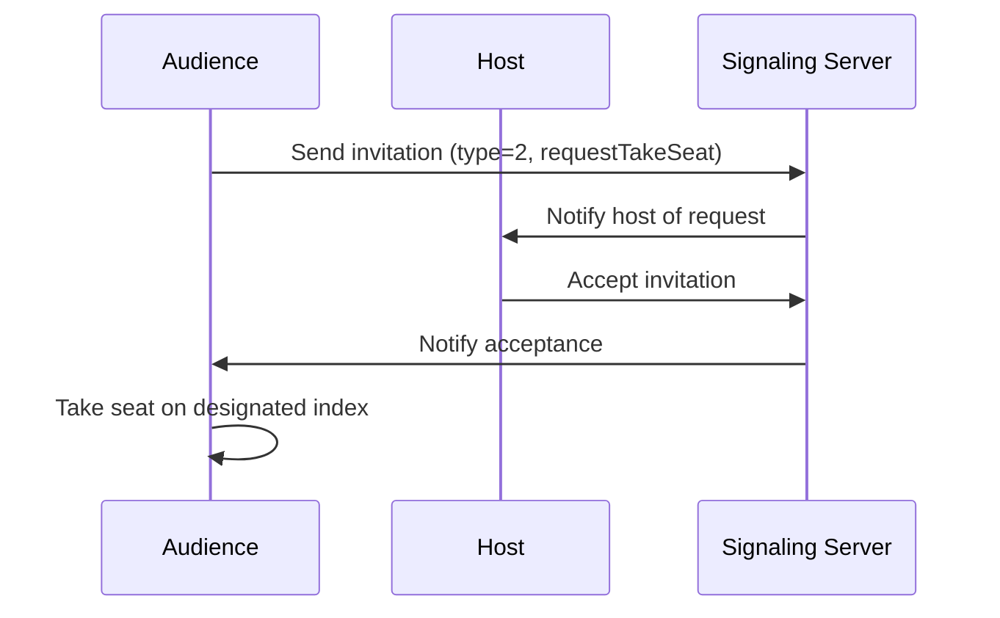
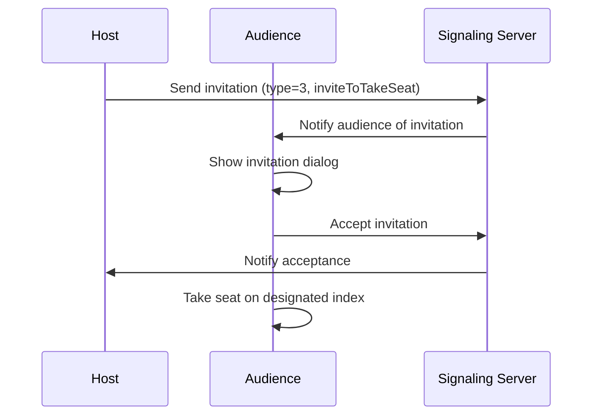
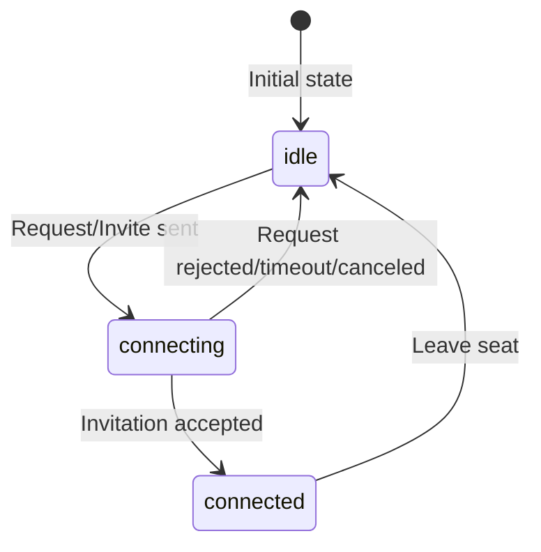

# Live Audio Room Connect Protocol

This document describes the connection protocol for the Live Audio Room, covering how audiences can connect (take a seat) to speak in the room.

## Overview

The Live Audio Room supports two methods for audiences to take a seat and become speakers:

1. **Audience-initiated**: Audience requests to take a seat
2. **Host-initiated**: Host invites audience to take a seat

Both methods use the signaling plugin to communicate invitations.

## Protocol Data Structure

### Audience Request Connect Protocol

Used to carry audience connection request information.

```dart
class ZegoAudioRoomAudienceRequestConnectProtocol {
  final ZegoUIKitUser user;    // Invitee user info
  final int targetIndex;        // Target seat index
}
```

**JSON Format:**
```json
{
  "user_id": "user_123",
  "user_name": "John Doe",
  "index": 2
}
```

### Invitation Types

| Type | Value | Description |
|------|-------|-------------|
| `requestTakeSeat` | 2 | Audience requests host to take seat |
| `inviteToTakeSeat` | 3 | Host invites audience to take seat |

## Connection Flow

### Flow 1: Audience Requests to Take Seat



**Steps:**
1. Audience clicks "Request to take seat" button
2. System sends invitation with type `requestTakeSeat` (2) to host
3. Host receives `onTakingRequested` callback
4. Host approves the request via UI
5. System sends acceptance via signaling
6. Audience receives invitation accepted, takes seat
7. Microphone is automatically enabled

### Flow 2: Host Invites Audience to Take Seat



**Steps:**
1. Host selects audience from member list
2. Host clicks "Invite to take seat"
3. System sends invitation with type `inviteToTakeSeat` (3)
4. Audience receives `onTakingInvitationReceived` callback
5. Dialog appears asking audience to accept/decline
6. If accepted, audience takes seat and microphone enables

## State Management

### Audience Connection States

| State | Description |
|-------|-------------|
| `idle` | Not connected, microphone off |
| `connecting` | Request sent, waiting for response |
| `connected` | On seat, microphone on |

### State Transitions



## Callback Events

### Host Callbacks

| Event | Description |
|-------|-------------|
| `onTakingRequested` | Audience requests to take seat |
| `onTakingRequestCanceled` | Audience cancels request |
| `onTakingInvitationRejected` | Audience rejects host's invitation |
| `onTakingInvitationFailed` | Invitation sending failed |

### Audience Callbacks

| Event | Description |
|-------|-------------|
| `onTakingInvitationReceived` | Received invitation from host |
| `onTakingRequestRejected` | Host rejected the request |
| `onTakingRequestFailed` | Request timed out |
| `onTakingFailed` | Failed to take seat |

## Error Handling

### Timeout Handling
- Invitation timeout: 60 seconds
- If no response, `onInvitationTimeout` or `onInvitationResponseTimeout` is triggered
- Connection state returns to `idle`

### Cancellation
- Audience can cancel request while in `connecting` state
- Host can cancel pending invitations via `hostCancelTakeSeatInvitation()`

## Use Cases

### Example 1: Audience Initiated

```dart
// Audience clicks request button
await ZegoUIKitPrebuiltLiveAudioRoomController
    .instance
    .seat
    .requestToTakeSeat(targetIndex: 2);
```

### Example 2: Host Initiated

```dart
// Host invites specific audience
await ZegoUIKitPrebuiltLiveAudioRoomController
    .instance
    .seat
    .inviteAudienceToTakeSeat(audienceUser);
```

## Notes

1. The protocol uses Zego's signaling plugin for real-time communication
2. Audience must grant microphone permissions before taking seat
3. Host can lock seats to prevent new connections
4. When seat is locked, pending requests are automatically canceled
5. The protocol supports both designated seat (specific index) and auto-assigned seat
